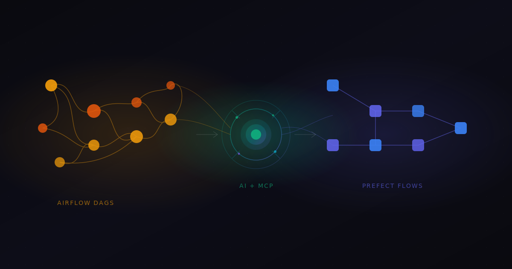
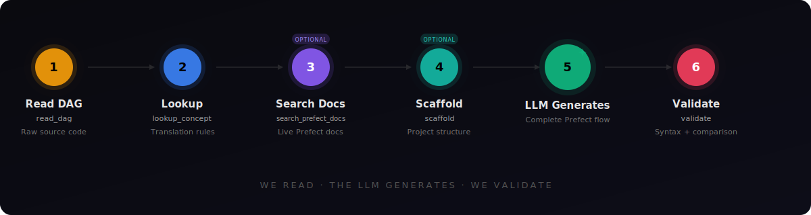
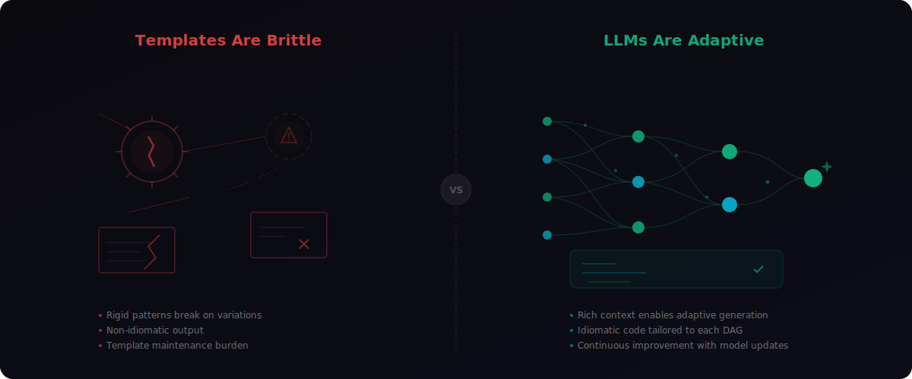

# Why We Built airflow-unfactor: AI-Powered Migration from Airflow to Prefect



**TL;DR** — We built an MCP server that makes migrating from Apache Airflow to Prefect trivial. Not "easier than before" trivial. Actually trivial. Point it at a DAG, and an LLM generates production-ready Prefect code. Here's why we did it and how it works.

---

## The Problem: Airflow Is Entrenched

Airflow has been the default workflow orchestrator for a decade. Enterprises have hundreds — sometimes thousands — of DAGs running critical pipelines. The code is deeply embedded in infrastructure, CI/CD, monitoring, and team workflows.

Migrating away from Airflow isn't a technical exercise. It's an organizational one. The DAGs themselves are just Python, but they're tangled with Airflow-specific patterns: XCom for data passing, Connections for secrets, Sensors for event handling, provider operators for cloud services, and trigger rules for conditional logic. Every DAG is a snowflake.

Traditional migration tools try to solve this with templates — rigid pattern-matching that maps Airflow constructs to Prefect equivalents. The problem is that Airflow and Prefect are architecturally dissimilar. Templates break on the first edge case. They produce non-idiomatic output. They require manual cleanup that often takes longer than rewriting from scratch.

We took a different approach.

## The Insight: Let LLMs Do What They're Good At

LLMs are exceptional at reading code, understanding intent, and generating idiomatic output in a target framework. What they need is context — the right knowledge at the right time.

That's what airflow-unfactor provides: an MCP server with five tools that give LLMs everything they need to convert any Airflow DAG into a clean Prefect flow.



The workflow is simple:

1. **Read the DAG** — `read_dag` returns the raw source code. No AST parsing, no structural extraction. The LLM reads the code directly, just like a developer would.

2. **Look up translation knowledge** — `lookup_concept` provides pre-compiled Airflow-to-Prefect mappings. We built a knowledge base called Colin with 78 translation entries covering operators, patterns, connections, sensors, and architectural concepts. Ask for "PythonOperator" and get the `@task` decorator equivalent with conversion rules.

3. **Search live Prefect docs** — `search_prefect_docs` queries the Prefect documentation MCP server at docs.prefect.io for anything not covered by the pre-compiled knowledge. Task caching? Concurrency limits? Work pools? It's all there, live.

4. **The LLM generates** — With the source code and translation knowledge in hand, the LLM produces complete, idiomatic Prefect flow code. Not a scaffold. Not a template with TODOs. Working code.

5. **Validate** — `validate` syntax-checks the generated code and returns both source files side-by-side with a comparison checklist. Did every task make it? Are dependencies preserved? Is XCom replaced with return values?

That's it. Five tools. No AST pipeline. No template engine. No brittle heuristics.

## How It Works in Practice

Here's what a real conversion session looks like. You open Claude Code (or any MCP client), point it at an Airflow DAG, and say "convert this to Prefect."

The LLM calls `read_dag` to get the source. It scans the imports and patterns, then calls `lookup_concept` for each one — PythonOperator, BashOperator, the connection patterns, the schedule. For anything unusual, it calls `search_prefect_docs`.

Then it writes the Prefect flow. Complete. With `@flow` and `@task` decorators, proper return-value data passing instead of XCom, Prefect blocks instead of Airflow connections, and a `prefect.yaml` deployment configuration.

Finally, it calls `validate` to confirm the generated code is syntactically valid and structurally faithful to the original.

The entire process takes about 30 seconds. For a DAG that would take a developer hours to convert manually.

### A Quick Example

Given this Airflow DAG:

```python
from airflow import DAG
from airflow.operators.python import PythonOperator
from datetime import datetime

with DAG("etl_pipeline", schedule="@hourly", start_date=datetime(2024, 1, 1)):
    extract = PythonOperator(task_id="extract", python_callable=extract_data)
    transform = PythonOperator(task_id="transform", python_callable=transform_data)
    load = PythonOperator(task_id="load", python_callable=load_data)
    extract >> transform >> load
```

The LLM generates:

```python
from prefect import flow, task

@task(retries=3, retry_delay_seconds=60)
def extract_data() -> dict:
    ...

@task
def transform_data(raw: dict) -> dict:
    ...

@task
def load_data(processed: dict):
    ...

@flow(name="etl-pipeline", log_prints=True)
def etl_pipeline():
    raw = extract_data()
    processed = transform_data(raw)
    load_data(processed)
```

Clean. Idiomatic. The `>>` dependency chain becomes explicit data passing through return values. The schedule moves to `prefect.yaml`. No XCom. No context dictionaries. Just Python.

## Why MCP Matters Here

airflow-unfactor is built on [FastMCP](https://github.com/jlowin/fastmcp), the library that Prefect's enterprise MCP Gateway (Horizon) evolved from. This isn't incidental — it demonstrates how well the MCP ecosystem supports sophisticated AI tooling.

The server exposes five tools over the Model Context Protocol. Any MCP-compatible client can use them: Claude Code, Claude Desktop, Cursor, or a custom integration. The tools compose naturally — an LLM orchestrates them in whatever order makes sense for a given DAG.



This is a concrete example of what decentralized, composable AI tools look like in practice. The MCP server doesn't try to be smart. It provides raw material — source code, translation knowledge, documentation, validation — and trusts the LLM to do the reasoning. The integrity and clarity of each tool's responsibility means the LLM always knows what it's getting and what to do with it.

Compare this to a monolithic "convert my DAG" endpoint that tries to handle everything internally. That approach is brittle, opaque, and impossible to debug. The MCP approach is transparent: you can see exactly what knowledge the LLM received, exactly what code it generated, and exactly what the validator found.

## The Philosophy

We started this project with a hypothesis: **deterministic code templating is the wrong abstraction for DAG conversion.**

Airflow and Prefect solve similar problems in fundamentally different ways. Airflow is declarative and configuration-driven. Prefect is imperative and Python-native. A PythonOperator with `op_kwargs` doesn't map 1:1 to a `@task` decorator — the entire execution model changes. XCom isn't "Prefect Variables with extra steps" — it's a completely different data-passing paradigm.

Templates can't handle this gap. They produce code that technically runs but doesn't feel like Prefect code. An experienced Prefect developer would write it differently.

LLMs can handle this gap. They understand both frameworks. They know that the right way to pass data in Prefect is through return values, not through a shared state store. They know that a sensor should become a polling task with retries, not a custom event loop. They generate code that a Prefect developer would actually write.

We provide the translation knowledge. The LLM provides the judgment.

**We read. The LLM generates. We validate.**

---

*airflow-unfactor is open source and available on [PyPI](https://pypi.org/project/airflow-unfactor/) and [GitHub](https://github.com/gabcoyne/airflow-unfactor). Install with `pip install airflow-unfactor` and add it to your MCP client configuration. Documentation at [gabcoyne.github.io/airflow-unfactor](https://gabcoyne.github.io/airflow-unfactor/).*
